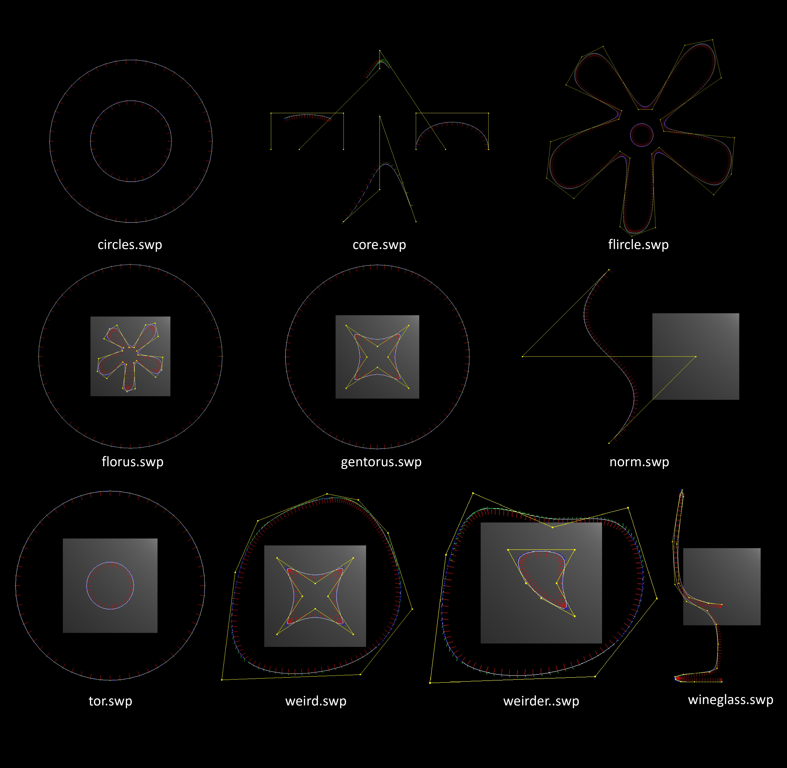

# 计算机图形学 Lab 1 曲线与曲面

> 黄宝岱 22307130480
> 
> 秦雯钧 22300240024

## 任务一：曲线的绘制

### 任务要求

在`curve.cpp`中填写`evalBezier`和`evalBspline`函数，生成和显示分段Bezier和B样条曲线，并正确计算其局部坐标系。

### 实现方法

#### Bezier曲线

连续的Bezier曲线的每一段之间共享一个控制点，因此总曲线段数为：

$$
\text{numSegments} = \frac{\text{numControlPoints} - 1}{\text{degree}}
$$

我们分别绘制每一段曲线，并按顺序将它们加入`Curve`类中，以绘制Bezier曲线。

根据题目要求，对于曲线中的每一段，我们要绘制`step`个点来描绘曲线。曲线计算公式所要求的$t\in[0,1]$，因此，我们用$t = \cfrac{i}{\text{step}}$来将每一步转换为所需的$t$值。

根据所提供的Bezier曲线的计算公式：

$$
P(t) = G_{BEZ}M_{BEZ}T=[P_1, P_2, P_3, P_4]\begin{bmatrix} 1 & -3 & 3 & -1 \\ 0 & 3 & -6 & 3 \\ 0 & 0 & 3 & -3 \\ 0 & 0 & 0 & 1 \end{bmatrix}\begin{bmatrix} 1 \\ t \\ t^2 \\ t^3 \end{bmatrix}
$$
$$
P'(t) = G_{BEZ}M_{BEZ}T=[P_1, P_2, P_3, P_4]\begin{bmatrix} 1 & -3 & 3 & -1 \\ 0 & 3 & -6 & 3 \\ 0 & 0 & 3 & -3 \\ 0 & 0 & 0 & 1 \end{bmatrix}\begin{bmatrix} 0 \\ 1 \\ 2t \\ 3t^2 \end{bmatrix}\\
$$

我们用`vecmath`中的`Matrix4f`和`Vector4f`定义了$G_{BEZ}$（$G_{BEZ}$是$3\times 4$的矩阵，矩阵的最后一行补零以符合$4\times 4$的要求）、$M_{BEZ}$以及曲线上点和其切线的不同 $T$，并对其进行矩阵乘法，以获得曲线上点和切线的对应坐标。

此后，我们需要计算曲线在该点的法线和次法线。根据所提供的公式，我们可以递归地更新方程：

$$
    B_0 = (0,0,1) \times T_1\\
    N_i = (B_{i-1} \times T_i).normalized()\\
    B_i = (T_i \times N_i).normalized()\\
$$

因此，我们只需调用`Vector3f::cross`和`Vector3f::normalized`等函数即可得到法线和次法线。

由于Bezier曲线中，相交曲线间共享一个控制点，因此我们跳过（除第一段曲线外）每段曲线的第一个控制点，以避免重复绘制。

#### B样条曲线

我们将B样条曲线的控制点转换为Bezier曲线的控制点，以实现B样条曲线的绘制。B样条曲线的每段之间共享三个控制点，因此总曲线段数为：
$$
\text{numSegments} = \text{numControlPoints} - 3
$$

我们分别将每一段曲线的控制点转换为Bezier控制点，并调用`evalBezier`获取这一段曲线的各个点的信息，将返回的点加入`Curve`类中，以绘制B样条曲线。

这里，我们不能一次性转换所有控制点并使用Bezier曲线进行绘图，因为B样条曲线各段间共享的控制点无法和Bezier曲线所共享的控制点一一对应，因此只能分段绘制。

Bezier曲线控制点与B样条曲线控制点的关系是：

$$
G_{BEZ} = G_B\cdot M_B \cdot M_{BEZ}^{-1}
$$

因此，我们同样用`Matrix4f`定义了这三个矩阵，并进行矩阵乘法，以获得Bezier曲线的控制点。

获得控制点后，我们调用`evalBezier`函数，获取曲线上各点的信息，并将其加入`Curve`类中，以绘制B样条曲线。

### 实验结果

