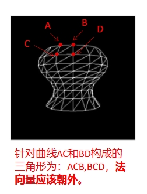

# 计算机图形学 Lab 1 曲线与曲面

> 黄宝岱 22307130480
>
> 秦雯钧 22300240024

## 任务一：曲线的绘制

### 任务要求

在 `curve.cpp`中填写 `evalBezier`和 `evalBspline`函数，生成和显示分段Bezier和B样条曲线，并正确计算其局部坐标系。

### 实现方法

#### Bezier曲线

连续的Bezier曲线的每一段之间共享一个控制点，因此总曲线段数为：

$$
\text{numSegments} = \frac{\text{numControlPoints} - 1}{\text{degree}}
$$

我们分别绘制每一段曲线，并按顺序将它们加入 `Curve`类中，以绘制Bezier曲线。

根据题目要求，对于曲线中的每一段，我们要绘制 `step`个点来描绘曲线。曲线计算公式所要求的$t\in[0,1]$，因此，我们用$t = \cfrac{i}{\text{step}}$来将每一步转换为所需的$t$值。

根据所提供的Bezier曲线的计算公式：

$$
P(t) = G_{BEZ}M_{BEZ}T=[P_1, P_2, P_3, P_4]\begin{bmatrix} 1 & -3 & 3 & -1 \\ 0 & 3 & -6 & 3 \\ 0 & 0 & 3 & -3 \\ 0 & 0 & 0 & 1 \end{bmatrix}\begin{bmatrix} 1 \\ t \\ t^2 \\ t^3 \end{bmatrix}
$$

$$
P'(t) = G_{BEZ}M_{BEZ}T=[P_1, P_2, P_3, P_4]\begin{bmatrix} 1 & -3 & 3 & -1 \\ 0 & 3 & -6 & 3 \\ 0 & 0 & 3 & -3 \\ 0 & 0 & 0 & 1 \end{bmatrix}\begin{bmatrix} 0 \\ 1 \\ 2t \\ 3t^2 \end{bmatrix}\\
$$

我们用 `vecmath`中的 `Matrix4f`和 `Vector4f`定义了$G_{BEZ}$（$G_{BEZ}$是$3\times 4$的矩阵，矩阵的最后一行补零以符合$4\times 4$的要求）、$M_{BEZ}$以及曲线上点和其切线的不同 $T$，并对其进行矩阵乘法，以获得曲线上点和切线的对应坐标。

此后，我们需要计算曲线在该点的法线和次法线。根据所提供的公式，我们可以递归地更新方程：

$$
B_0 = (0,0,1) \times T_1\\
    N_i = (B_{i-1} \times T_i).normalized()\\
    B_i = (T_i \times N_i).normalized()\\
$$

因此，我们只需调用 `Vector3f::cross`和 `Vector3f::normalized`等函数即可得到法线和次法线。

由于Bezier曲线中，相交曲线间共享一个控制点，因此我们跳过（除第一段曲线外）每段曲线的第一个控制点，以避免重复绘制。

#### B样条曲线

我们将B样条曲线的控制点转换为Bezier曲线的控制点，以实现B样条曲线的绘制。B样条曲线的每段之间共享三个控制点，因此总曲线段数为：

$$
\text{numSegments} = \text{numControlPoints} - 3
$$

我们分别将每一段曲线的控制点转换为Bezier控制点。Bezier曲线控制点与B样条曲线控制点的关系是：

$$
G_{BEZ} = G_B\cdot M_B \cdot M_{BEZ}^{-1}
$$

由于两条连续的Bezier曲线必然共享一个相同的控制点，除第一次外，我们每次只需将转换后的后三个控制点加入Bezier曲线控制点集中。

获得控制点后，我们调用 `evalBezier`函数，以绘制B样条曲线。

### 实验结果

## 任务2：曲面的绘制

### 任务要求

在 `surf.cpp`中填写 `makeSurfRev`和 `makeGenCyl`函数，第一个函数生成旋转曲面，第二个函数生成广义圆柱体。

#### 旋转曲面

给定一条曲线，包含它的点坐标、法线向量、次法线向量、切向量。再给定旋转的步数，返回这条曲线以y轴正方向为轴，逆时针旋转变换生成的旋转体。

沿着曲线将曲线中的每一个点和向量都做如下的变换，每次旋转角度为 `2π / steps`，并将它们存在 `surface.VV`和 `surface.VN`里：

$$
M = R_y(\theta) = 
\begin{bmatrix}
\cos \theta & 0 & \sin \theta & 0 \\
0 & 1 & 0 & 0 \\
-\sin \theta & 0 & \cos \theta & 0 \\
0 & 0 & 0 & 1
\end{bmatrix}
$$

$$
P' = M \cdot P
$$

$$
N' = \text{normalize}\left((M^{-1})^T N\right)
$$

其中需要注意的是要将原本的点坐标和法向量做齐次化的变换。

随后便是三角形的生成。按照文档的要求实现了 `generate_triangles`函数，根据 `profileSize`和 `steps`为 `surface`生成三角形面的顶点坐标集。顺序如下图所示：



#### 广义圆柱体

广义圆柱体需要将形状曲线按扫掠曲线的坐标系进行变换。即对于广义曲线的每一个点，都要用扫掠曲线的M矩阵做变换，并存到 `surface.VV`当中。

法向量也要做如下的变换，并存到 `surface.VN`当中

$$
M  = 
\begin{bmatrix}
\ N & B & \ T  & V \\
0 & 0 & 0 & 1 \\
\end{bmatrix}
$$

$$
P' = M \cdot P
$$

$$
N' = \text{normalize}\left((M^{-1})^T N\right)
$$

其中需要注意的是要将原本的点坐标和法向量做齐次化的变换.

三角形面的生成用 `generate_triangles`函数即可。

### 实验结果

## 拓展：曲面的闭合问题

我们使用的计算坐标系的方法不能保证闭合曲线在相交处对齐。因此，可能出现曲面无法闭合的情况。我们通过旋转曲线上各点的法向量和次法向量，将开始和结束位置的N对齐来解决这一问题。

对于按以上方法生成的曲线，我们检测它的开始和结束位置的点是否有相同的V和T，但N不同：

```cpp
if (approx(Bezier.front().V, Bezier.back().V) &&
approx(Bezier.front().T, Bezier.back().T) &&
!approx(Bezier.front().N, Bezier.back().N)
```

若其存在无法闭合的问题，我们通过旋转曲线上每个点的N和B向量，对曲线进行插值，以对齐曲线的开始点法向量和结束点法向量。对于曲线的第 $i$ 个点，我们使用以下公式计算其旋转的角度：

$$
\alpha = arccos(N_{start}, N_{end})\\
\theta_i = \cfrac{\alpha}{\# points\_in\_curve }\times i
$$

我们使用罗德里格旋转公式将法向量 $N_{i}$ 沿 $T_i$ 进行旋转。由于 $B_i = T_i\times N_i$，我们可以将罗德里格旋转公式化简为：

$$
N_i' = cos\theta N_i+sin\theta B_i
$$

最后，我们通过$B_i'=T_i\times N_i'$ 计算次法向量，完成插值旋转。
