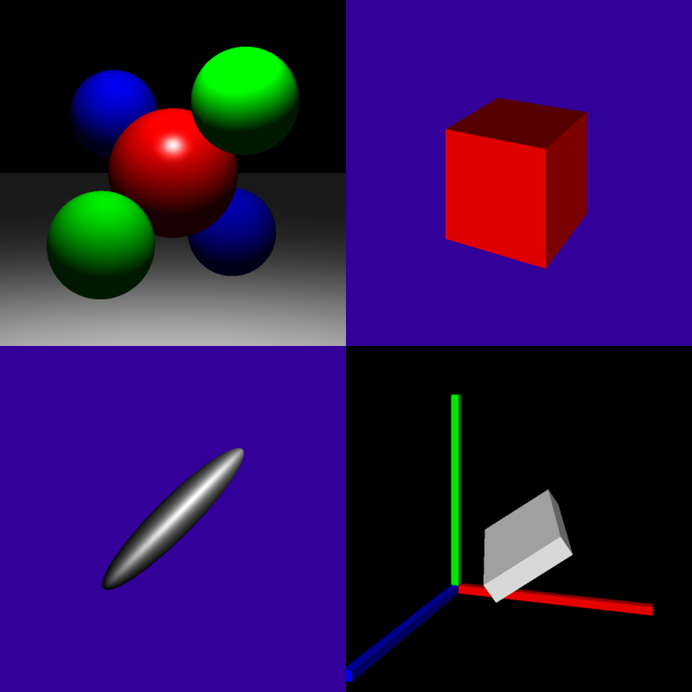
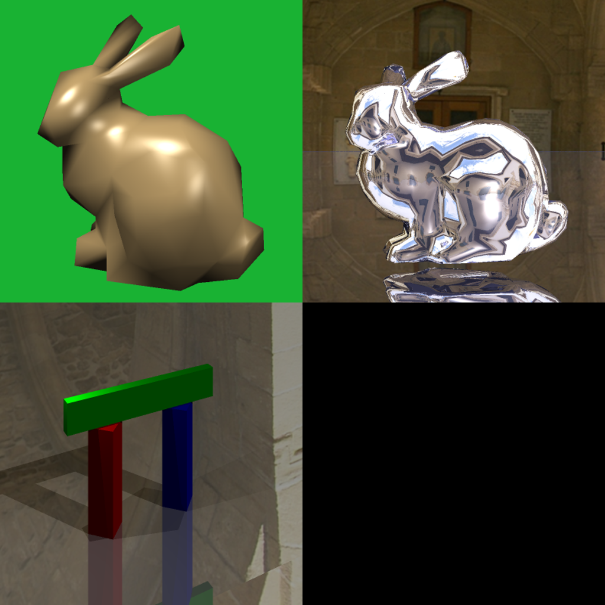
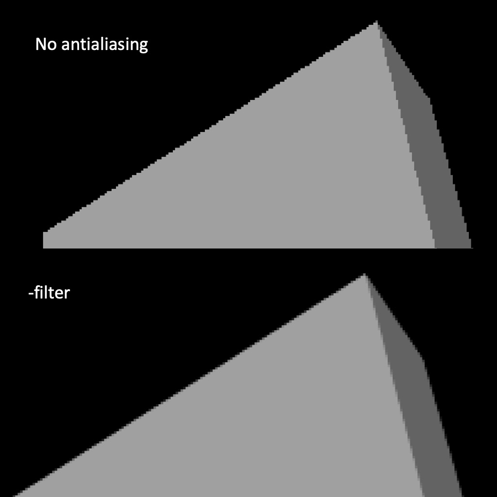
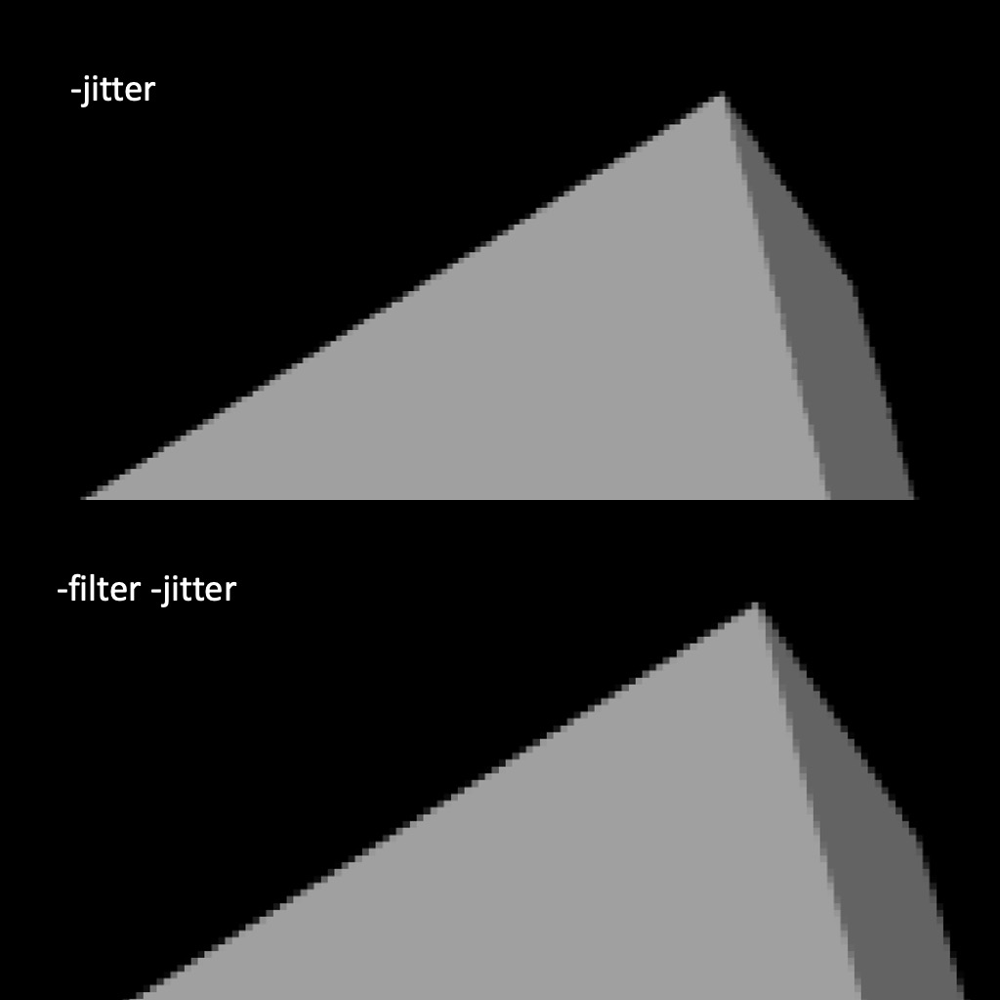

# 计算机图形学 Project 2 光照模型与光线追踪

> 黄宝岱 22307130480
>
> 秦雯钧 22300240024

## 任务一：Phong光照模型

### 任务要求

在 `Light.cpp`中填写 `PointLight::getIllumination()`方法，获取点光源对于给定点的相关信息；在 `Material.cpp`中填写 `Material::shade()`方法，返回漫反射强度和镜面反射强度之和；最后在 `Renderer::traceRay()`中完成 `Phong`光照模型的计算。

---

### 实现方法

#### PointLight::getIllumination()方法

按照文档中的提示信息完成 `tolight`，`intensity`和 `distToLight`的赋值即可。光强的计算需要用到以下公式：

$$
L ( x _ { \mathrm { s u r f } } ) = \frac { I } { \alpha d ^ { 2 } }
$$

#### Material::shade()方法

按照文档中的提示信息计算漫反射强度，和镜面反射强度,然后返回二者之和。其中完美反射矢量 `R`需要进行如下的计算：

```c++
    Vector3f R = (2.0f * Vector3f::dot(L, N) * N - L).normalized();
```

用到的公式如下：

$$
\text{clamp}(\mathbf{L}, \mathbf{N}) = 
\begin{cases} 
\mathbf{L} \cdot \mathbf{N} & \text{if } \mathbf{L} \cdot \mathbf{N} > 0 \\ 
0 & \text{otherwise} 
\end{cases}
$$

$$
I_{\text{diffuse}} = \text{clamp}(\mathbf{L} \cdot \mathbf{N}) \cdot L \cdot k_{\text{diffuse}}
$$

$$
I_{\text{specular}} = \text{clamp}(\mathbf{L} \cdot \mathbf{R})^s \cdot L \cdot k_{\text{specular}}
$$

#### Renderer::traceRay()方法

具体做法是先获取环境光信息，然后对 `_scene`中的所有光进行遍历获取光照信息，再调用之前实现的 `Material::shade()`方法计算该光对该物体造成的反射强度，和镜面反射强度之和，累加环境光，最后遍历结束获得的累加结果便是给定视线看到物体的颜色。

这个方法中，用到的公式如下：

$$
I_{\text{ambient}} =  L_{\text{ambient}} \cdot  k_{\text{diffuse}}
$$

$$
I = I_{\text{ambient}} + \sum_{i \in \text{lights}} \left( I_{\text{diffuse},i} + I_{\text{specular},i} \right)
$$

---

## 任务二：光线投射

### 任务要求

在 `Object3D.cpp`中填写 `Plane`、 `Triangle`、`Transform` 的 `Intersect()`函数的实现。

---

#### 平面类

因为该project中平面的表示是p*n = d，所以需要给平面类添加一个成员_p，用于记录平面内的一点，方便计算。完成初始化函数后，开始实现 `Intersect()`函数。

首先计算 `d * N`，然后判断 `d * N`是否为0，若为0，则说明视线与该平面平行，直接返回 `false`，不相交。然后根据文档提供的公式进行t的计算，若 `t < tmin` 或者 ` t >= h.getT()` 都返回 `false`，否则更新 `h`的 `t`值，返回 `true`。

用到的公式如下：

$$
t = \frac{(p' - o) \cdot N}{d \cdot N}
$$

#### 三角形类

首先获取三角形所在平面的法向量，两边的向量叉乘即可。

```c++
    Vector3f u = _v[1] - _v[0];
    Vector3f v = _v[2] - _v[0];
    Vector3f n = Vector3f::cross(u, v).normalized();
```

再获取平面的 `d`值，平面法向量点乘三角形任一点坐标即可。然后根据这些信息生成一个平面，再用之前实现的平面的 `Intersect()`函数判断是否相交，并且获取 `t`值。用这个 `t`值生成 `hit_point`，并且根据文档中的公式判断该点是否在三角形内，公式如下：

$$
P = (1 - u - v) A + u B + v C
$$

其中 `u`,`v`都在 `0-1`之间。若不满足点在三角形内的条件则返回 `false`，在的话需要计算该点的法向量，即：

```c++
Vector3f final_normal = param.x() * _normals[0] + param.y() * _normals[1] + param.z() * _normals[2];

```

最后与前面一样，若 `t`值小于 `h.getT()`则更新，返回 `true`。否则返回 `false`。

#### 变换类

首先为变换类添加一个4*4的矩阵成员，写好初始化方法。在 `intersect`函数的实现中，需要将视线原点和视线方向，变换到局部坐标系中。具体的方法便是将视线原点和视线方向齐次化后乘以 `Transform`类中矩阵的逆矩阵 `ray_local`，得到。然后将这个变换后的视线用于 `Transform`类成员 `object`的intersect函数，代码如下：

```c++
    if (_object->intersect(ray_local, tmin, my_hit) == false)
        return false;
```

因为计算的是局部坐标系的法向量，所以还需要将法向量通过变换转换为世界坐标系。这里用到了project 1的公式，将法向量齐次化以后乘以Transform类中矩阵的逆转置矩阵即可。公式如下：

$$
N' = \text{normalize}\left((M^{-1})^{T} N \right)
$$

值得注意的是 `t`值是无需变换的。因为变换前后光源到击中点的距离是不变的。最后对比所得的 `t`值和 `h.getT()`的大小，若小于则更新 `h`的 `t`值，返回 `true`；否则返回 `false`。

---

## 任务三：光线追踪与阴影投射

### 任务要求

1. 实现光线追踪：通过在渲染器中递归进行函数调用来实现光线跟踪。
2. 实现阴影投射：计算被遮挡物体投射的阴影。

---

### 实现方法

#### 光线追踪

对于能够多次反射光线的镜面材料而言，被相机捕捉到的光线颜色是光线多次反射后的总和。因此，我们可以通过递归地调用 `traceRay` ，累加得到最终捕捉到的光线。

在 `Renderer::traceRay` 中，在遍历所有光源并计算出直接光之和（`finalColor`）后，首先用所计算的入射光线计算反射光线的方向和强度。经推导可知，完美反射光为：

$$
R = -L + 2 (L · N) N
$$

其中，$L$ 是从交点指向光的向量；$N$ 是平面法线。

计算出反射光线后，以反射光线作为新的入射光线，再一次调用 `traceRay` ，计算此后的总反射光线，直到达到最大递归深度（`bounces`）。计算出当前光线的反射光后，将其乘以材料的反射率，并与此前计算的直接光加和，即可得到总光强：

$$
I_{total} = I_{direct} + k_{specular}*I_{indirect}
$$

#### 阴影投射

如果当前渲染的点与光源的连线上有其他物体，说明它被遮挡，处于阴影中，不应该被渲染。

就具体实现而言，我们在 `traceRay` 中，每次对所渲染的点调用 `shade` 之前，先从当前点向光源发射一条射线（阴影射线）。如果这条射线所遇到的第一个物体与当前点的距离小于该点与光源的距离，则认为它被别的物体遮挡，因此不应该被渲染，不会对该点调用 `shade` 方法。

在 `traceRay` 遍历所有光源时，我们需要对每个光源都计算一遍该光源是否被遮挡。因此，计算阴影的代码应当放在遍历光源的 `for` 循环内部。

同时，对于光线追踪和阴影投射两个任务，我都将反射光线/阴影光线沿其方向移动了一个小量（`eps = 1e-4`）。这可以避免光线与发射的物体本身相交，产生self shading问题。

---

## 任务四：抗锯齿

### 任务要求

1. 实现抖动采样 `-jitter`。
2. 实现高斯滤波 `-filter`。

---

### 实现方法

首先定义这两个参数在单独和分别被指定时的行为：

1. 仅 `-jitter` ：对 $h\times w$ 大小的图像进行重复16次的充分采样。
2. 仅 `-filter` ：使用普通采样渲染 $3h\times 3w$ 大小的图像；再通过 $\sigma = 1$ 的高斯滤波器将其下采样至原本大小。
3. `-jitter -filter` ：使用抖动采样渲染大小为 $3h\times 3w$ 的图像；再通过 $\sigma = 1$ 的高斯滤波器将其下采样至原本大小。

#### 抖动采样

抖动采样的原理是：对于我们要渲染的每个像素，在像素内随机偏移采样点，重复生成多条射线进行渲染，最后对所有射线得到的颜色进行平均，得到这个像素的颜色。

在代码实现中，我们在普通的采样循环中，加入对采样数的循环，在循环中累加每次采样点的color、depth和normal，并在整个采样过程结束后对它们进行平均，以得到采样数据：

```cpp
for (int s = 0; s < samples; ++s){

    float jitter_x = (rand() / (float) RAND_MAX) - 0.5f; 
    float jitter_y = (rand() / (float) RAND_MAX) - 0.5f; 

    float ndcx = 2 * ((x + 0.5f + jitter_x) / w) - 1.0f;
    float ndcy = 2 * ((y + 0.5f + jitter_y) / h) - 1.0f;

    Ray r = cam->generateRay(Vector2f(ndcx, ndcy));
    Hit hit;
    Vector3f color = traceRay(r, cam->getTMin(), _args.bounces, hit);

    color_sum += color;
    normal_sum += (hit.getNormal() + 1.0f) / 2.0f;

    float range = (_args.depth_max - _args.depth_min);
    if (range){
      	depth_sum += Vector3f((hit.t - _args.depth_min) / range);
    }
}

```

#### 高斯滤波

高斯滤波需要我们：

1. 渲染 `3x` 大小图像。
2. 对超采样图像进行高斯滤波，把每个 `3x3` 像素合为一个像素。

在代码实现中，前一部分只需要我们将输入的图像大小乘以三倍；对于后一步，我们实现了 `ApplyGaussianFilter` 方法，对原分辨率图像下的每个像素遍历超采样图像中其周围（`3x3`范围）像素，并将它们与高斯核做逐元素积，得到高斯后的结果：

```cpp
for (int y = 0; y < h; ++y){
  for (int x = 0; x < w; ++x){
    Vector3f blurred = Vector3f::ZERO;

    for (int dy = -1; dy <= 1; ++dy){
      for (int dx = -1; dx <= 1; ++dx){
        // 防止出界
        int sx = clamp(x * 3 + dx, 0, img.getWidth() - 1);
        int sy = clamp(y * 3 + dy, 0, img.getHeight() - 1);

        blurred += img.getPixel(sx, sy) * kernel[dy + 1][dx + 1];
      }
    }

    result.setPixel(x, y, blurred / kernelSum);
  }
}
```

---

### 实验结果

测试基础部分：在starter2文件夹下运行：

```bash
mkdir out && cd out && mkdir basics
cd ..
source generate_images.sh
```

测试拓展部分请自行修改 `generate_images.sh`.








